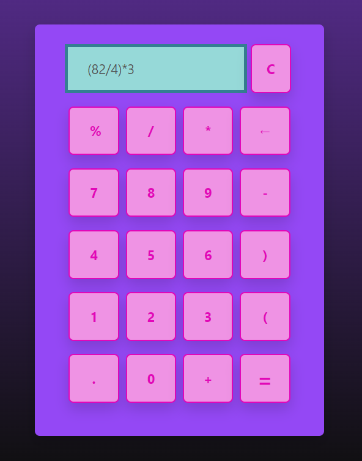

# Calculator App

A modern and user-friendly web-based calculator application built using React.

## Overview

The Calculator App is a user-friendly web application developed with React. It provides a sleek and intuitive interface for performing basic arithmetic operations and includes additional features like percentage calculations, clear/reset functionality, and a backspace button.

## Features

- Basic arithmetic operations: addition, subtraction, multiplication, and division.
- Percentage calculation.
- Clear button to reset the input.
- Backspace button (←) to delete the last character.
- Stylish and modern user interface.

## Technologies Used

- React
- JavaScript
- HTML/CSS
- Bootstrap

## Author

- Kanjaa Douae

## How to Use

1. Clone this repository to your local machine.
2. In the project directory, run `npm install` to install the necessary dependencies.
3. Run `npm start` to start the development server.
4. Open your web browser and visit `http://localhost:3000` to use the Calculator App.

Enjoy fast and efficient calculations with our user-friendly Calculator App!

---

